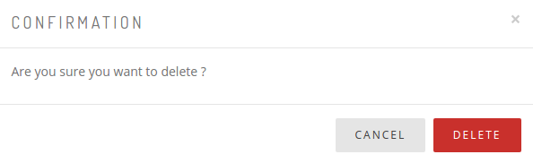

Chúng ta thường xuyên dùng modal để confirm, login,... Vậy làm thế nào để sử dụng nó một cách tiện lợi, dễ tuỳ chỉnh, `dùng nhiều nơi và chỉ sửa một nơi`.

<!--more--> 

### Modal Bootstrap Native




Ta có thể chia một modal bao gồm các phần:
+ Header (`modal-header`): 
    + Hiển thị `title`.
    + Ẩn modal khi click `x`.
+ Body (`modal-body`, `modal-footer`): 
    + Hiển thị nội dung
    
### Đặt vấn đề

Ví dụ một page hiển thị thông tin 50 products và các options edit, delete. Các option này nếu sử dụng modal tĩnh => template cần render ra 100 cái modal.
Vậy `Ý tưởng` ở đây là khi click edit hoặc delete sẽ append một modal tương ứng vào .

### Phương án giải quyết
Template cho page:
```twig
{# Một button để kích hoạt modal, có href dẫn tới `deleteAction` trong controller. #}
<button href="/delete" class="js-modal-trigger">Delete</button>

{# Thêm đoạn html modal vào cuối page, nơi để append content modal. #}
<div class="modal js-modal-wrapper" role="dialog" aria-hidden="true">
    <div class="modal-dialog">
        <div class="modal-content">
        </div>
    </div>
</div>
```
Template `modal.html.twig` chung gồm:
```twig
<div class="modal-header">
    <button type="button" class="close" data-dismiss="modal">&times;</button>
    <h4 class="modal-title"></h4>
</div>
<div class="modal-body">
    
</div>
```
Template cụ thể extends `modal.html.twig` để render ra modal-content mình cần, ví dụ như `example.html.twig`:
```twig

Confirmation

    <p><span>Are you sure you want to delete ?</span></p>
    <form method="post" action="{{ link }}">
    <div class="form-footer">
            <button type="button" class="btn btn-default" data-dismiss="modal"><i class="fa fa-close"></i> Cancel</button>
            <button type="submit" class="btn btn-danger"><i class="fa fa-trash"></i> Delete</button>
    </div>
    </form>

```
`deleteAction`
```php
/**
 *@Route("/delete", name="delete_action")
 *@Method({"GET", "POST"})
 */
public function deleteAction(Request $request)
{
    if ($request->isMethod('POST')) {
        //code xử lý khi form trên modal được submit
    }
    
    //render ra nội dung của modal kèm đường dẫn cho form trong modal
    return $this->>render('example.html.twig', [
        'link' => '/delete'
    ]);
}
```
Javascrip xử lý:
```javascript
import Modal from 'bootstrap.native';

//Sử dụng fetch để xử lý ajax request, có thể thay bằng XMLHttpRequest
import 'whatwg-fetch';
```
+ Tạo Modal
```javascript
const modalEl = document.querySelector('.js-modal-wrapper');
const modalInstance = new Modal(modalEl,
{
  backdrop: 'static',
  keyboard: false
});
```
+ Detect sự kiện click cho page
```javascript
document.addEventListener('click', (e) => {
  const triggerEl = e.target;  
  if (!triggerEl || !triggerEl.matches('.js-modal-trigger')) {
    return;
  }
  
//Lấy href render content của modal và ngăn sự kiện click của button
  e.preventDefault();
  const url = triggerEl.href;
    
// Gửi ajax request lấy được nội dung của modal, sau đó append vào modalInstance đã tạo ở trên, và cuối cùng là show modal.
  fetch(url, { credentials: 'same-origin' })
      .then(response => response.text())
      .then((body) => {
      modalInstance.setContent(body);
      modalInstance.show();
      });
  });
```
### Lưu ý

Nếu trong thẻ dùng để kích hoạt modal mà có chứa thẻ khác như:
```twig
<a class="js-modal-trigger">
    <i></i>
</a>
```
Điều này sẽ dẫn tới khi click vào có thể là thẻ `i`, để tránh điều này thì trong javascript ta cần sửa một chút như sau:
```javascript
document.addEventListener('click', (e) => {
  const triggerEl = e.target.closest('a');
  //...
}
```